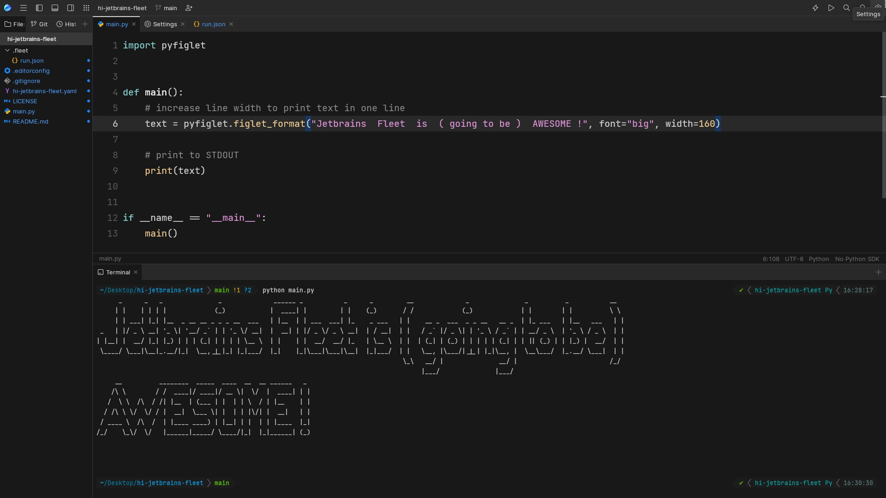

# hi-jetbrains-fleet

Small repository for demonstrating features in the public preview of JetBrains Fleet.

## How to run

All you need is Python3 and the `pyfiglet` package. I suggest Python 3.9 or higher. You can also install the conda environment `hi-jetbrains-fleet`.

1. Install the conda environment via `conda env create -f hi-jetbrains-fleet.yaml`
2. Activate the environment via `conda activate hi-jetbrains-fleet`
3. Run the main script via `python main.py`!

## License

All code is licensed under the MIT license.
